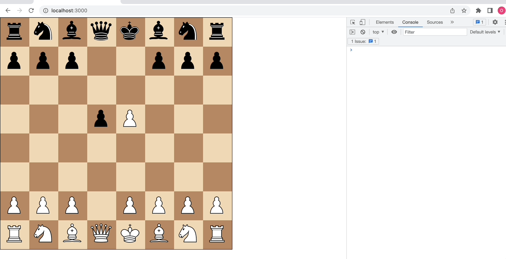

# Chess



## Description
Chess (excluding en-passant) built in JavaScript / React / React-Dnd.

## Live (please use Firefox):
[AWS EC2](https://chess.octaviandd.com)

## Features
- Full-fledged Chess game implementation.
- Drag and drop functionality using React-Dnd.
- Built with modern JavaScript and React.

## Installation

To run this project locally, follow these steps:

1. **Clone the repository:**
   ```bash
   git clone https://github.com/octaviandd/Chess.git
   ```
2. **Navigate to the project directory:**
   ```bash
   cd Chess
   ```
3. **Install the dependencies:**
   ```bash
   npm install
   ```

## Usage

To start the application, run:
```bash
npm run start
```

Make sure to use Google Chrome for the best experience.

## Contributing

Contributions are welcome! If you have any ideas or improvements, please feel free to open an issue or submit a pull request.

## License

This project is licensed under the MIT License. See the LICENSE file for more details.

## Acknowledgements

- This project uses [React-Dnd](https://react-dnd.github.io/react-dnd/about) for drag-and-drop functionality.

## Contact

For any questions or feedback, you can reach out to the project owner [octaviandd](https://github.com/octaviandd).

Feel free to customize any sections further based on your needs. Let me know if you want me to assist with committing this to your repository.
